# Hito 1 : Elaboración del Código, HUs e Hitos

## Historias de Usuario

Para esta parte del documento definiremos las siguientes Historias de Usuarios:

- [HU1 - Como usuario quiero ingresar nuevos activos fijo.](https://github.com/gabrielacampoverde/CC_Gabriela/issues/1)

- [HU2 - Como usuario quiero transferir activos fijos de un lugar a otro.](https://github.com/gabrielacampoverde/CC_Gabriela/issues/2)

- [HU3 - Como usuario quiero tener reportes de activos fijos por diferentes parametros de busqueda.](https://github.com/gabrielacampoverde/CC_Gabriela/issues/3)

- [HU4 - Como desarrollador quiero automatizar las opciones de ingreso](https://github.com/gabrielacampoverde/CC_Gabriela/issues/4)

- [HU5 - Como usuario de contabilidad quiero generar depreciación mensual de los activos fijos.](https://github.com/gabrielacampoverde/CC_Gabriela/issues/5)
  

## Estrutura del proyecto

Para el desarrollo del proyecto lo dividiremos en tres partes el frondend, backend, y base de datos; explicaremos cada una de estas herramientas a continuación:

 - Frontend: 
   
   Para el frontend se usara el lenguaje de JavaScript, porque permite la creación de interfaces de usuario interactivas y dinámicas. Esto es esencial para un ERP, ya que los usuarios deben interactuar con datos en tiempo real, realizar actualizaciones y recibir retroalimentación instantánea.
   
   Con JavaScript se puede crear una experiencia de usuario más fluida y agradable. Se puede implementar funciones como la carga asincrónica de datos, validaciones en el lado del cliente y efectos visuales para mejorar la usabilidad para el cliente. Con JavaScript se puede personalizar la interfaz de usuario del ERP de acuerdo a las necesidades específicas que requiere la universidad. 
   
  
 - Backend:
 
   Para el desarrollo del backend usaremos el lenguaje de programción PHP, ya que es conocido por ser un lenguaje relativamente fácil de aprender, lo que puede acelerar el desarrollo y permitir que los desarrolladores nuevos se integren rápidamente en el proyecto. Tambien nos permite un desarrollo ágil y rápido, lo que es beneficioso para crear y adaptar un sistema ERP a las necesidades cambiantes de una empresa.
 
   PHP se integra bien con una variedad de sistemas de gestión de bases de datos, como MySQL, PostgreSQL y SQLite, lo que es esencial para un sistema ERP que debe gestionar grandes volúmenes de datos, en este caso se trabajara en PostgreSQL.
 
   PHP se ejecuta en diferentes sistemas operativos, lo que facilita la implementación en varios entornos, incluyendo servidores Windows, Linux y macOS. Para este caso se iniciara el desarrollo en un sistema de Linux.
 
   Usaremos PHP porque es de código abierto y gratuito, lo que puede reducir los costos de desarrollo y licenciamiento en comparación con otras tecnologías. Adicional cuenta con una arquitectura adecuada y tiene buenas prácticas de desarrollo, PHP puede ser escalable y capaz de manejar grandes volúmenes de datos y usuarios a medida que la empresa crece.
   
   Para iniciar el proyecto se procedera a instalar PHP en el sistema opertivo de Linux, con los siguientes pasos:
   
   1.- Abrimos un terminal y nos debemos de asegurarte de que los paquetes están actualizados, así que ejecuta este comando de Linux en la Terminal. 
   
   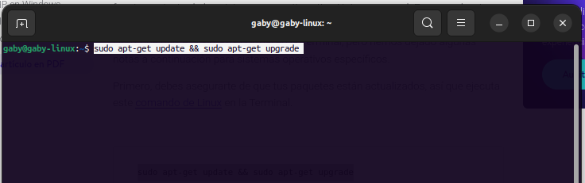
   
   2.- Ahora estás listo para instalar PHP. El comando para hacerlo es fácil y sencillo.
   
   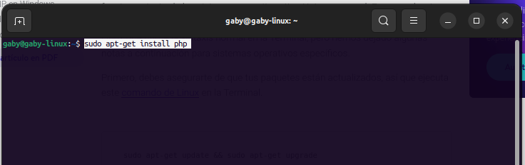
  
   3.- Esto instalará la última versión de PHP junto con varias extensiones. Puedes usar este código para ver qué versión tienes.
   
   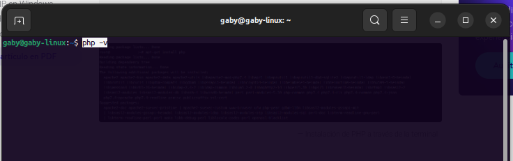
   
 - Base de Datos:
 
  Para administrar la base de datos usaremos PostgreSQL ya que es compatible con múltiples sistemas operativos, incluyendo Windows, Linux, macOS y otros sistemas UNIX. Esto facilita su implementación en una variedad de entornos informáticos; para nuestro caso trabajaremos en Linux. PostgreSQL es altamente escalable, lo que es crucial para un sistema ERP que necesita manejar grandes volúmenes de datos y usuarios a medida que la empresa crece. Puede escalar vertical u horizontalmente según sea necesario.
 
 Seguiremos los siguientes pasos para la instalación de PostgreSQL:
 
  1.- Actualice el índice del paquete local de su servidor:
 
  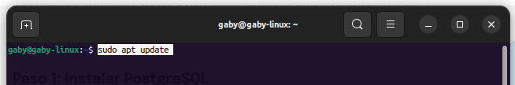
 
  2.- Se puede descargar e instalar el paquete PostgreSQL con un solo comando
 
  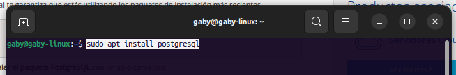
  
  3.- Una vez instalado el sistema de gestión de bases de datos, inicia PostgreSQL:
  
  
  
  4.- Consulta el estado de PostgreSQL para comprobar si realmente se está ejecutando:
  
  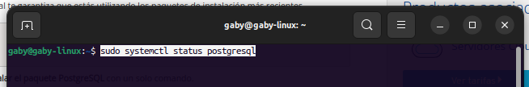
  
  El servicio debería aparecer como “activo”. Utiliza la tecla [Q] para salir de la pantalla de estado.

  5.- Después de la instalación, PostgreSQL dispone de una cuenta por defecto llamada “postgres”. Puedes activarla con el siguiente comando:
  
  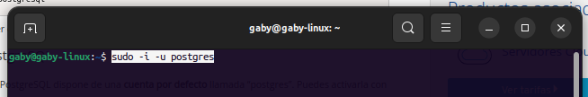
  
  6.- Ubuntu se comporta como si hubieras iniciado sesión con la cuenta de PostgreSQL, es a partir de entonces cuando puedes acceder al prompt del SGBD.
  
  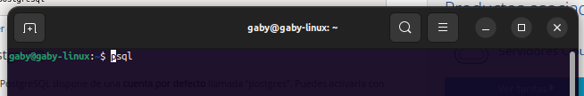
  
  7.- Una vez estés trabajando en el entorno de PostgreSQL, utiliza el siguiente comando para mostrar qué conexión está activa actualmente:
  
  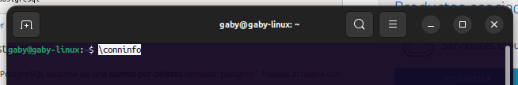
  
  8.- Utiliza el siguiente comando para abandonar el entorno de PostgreSQL:
  
  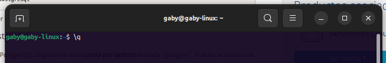
  
  9.- El sistema ha creado automáticamente una base de datos correspondiente al usuario “postgres”. Sin embargo, tu servidor PostgreSQL puede trabajar con varias bases de datos al mismo tiempo. Crea una nueva base de datos con el siguiente comando, en el cual puedes cambiar “example” por el nombre que quieras:

  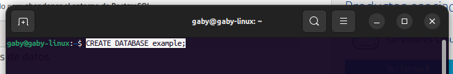

  
## Hitos del proyecto

Para para esta parte del documento vamos a describir cada uno de los hitos el proyecto:

- [Hito 1: Definir el proyecto](https://github.com/gabrielacampoverde/CC_Gabriela/milestone/1)

- [Hito 2: Migrar la data de los activos fijos a PostgreSQL](https://github.com/gabrielacampoverde/CC_Gabriela/milestone/2)

- [Hito 3: Creación de las opciones para el usuario](https://github.com/gabrielacampoverde/CC_Gabriela/milestone/3)

- [Hito 4: Creación reportes necesarios](https://github.com/gabrielacampoverde/CC_Gabriela/milestone/4)

- [Hito 5: Creación de Doker para pruebas](https://github.com/gabrielacampoverde/CC_Gabriela/milestone/5)

- [Hito 6: Cargar las opciones desarrolladas a un servidor](https://github.com/gabrielacampoverde/CC_Gabriela/milestone/6)
 
  
  
  
  
  
  
  
  
  
  
  
  
  
  
  
 
 
