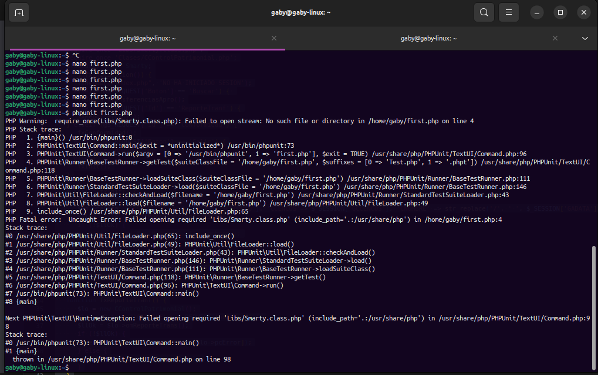

# Hito 2 : Test, Librerias y Bibliotecas

## Test

### PHPUnit
  
    PHPUnit es un framework de pruebas unitarias para el lenguaje de programación PHP. Fue desarrollado originalmente por Sebastian Bergmann y se ha convertido en la herramienta estándar para realizar pruebas unitarias en proyectos PHP. PHPUnit facilita la creación y ejecución de pruebas automatizadas para garantizar que el código funcione correctamente y cumpla con los requisitos esperados.
    
    PHPUnit es ampliamente utilizado en la comunidad de desarrollo de PHP y es una herramienta valiosa para garantizar la calidad del código al automatizar y facilitar el proceso de pruebas unitarias.
    
### Cómo realizar test

Para realizar el test siguiremos los siguientes pasos:

  - **Primero:** Se instala el framework [PHPUnit](https://linux.how2shout.com/3-ways-to-install-phpunit-in-ubuntu-22-04-or-20-04-lts/)
  - **Segundo:** Verificar si la instación fue exito con el siguiente comando **$ phpunit --version**
  
     
     
  - **Tercero:** Abrimos el documento first.php
  
     

  - **Cuarto:** Al abrirse el documento first.php copiaremos las lineas de codigo que php.
  
     
     
  - **Quinto:** Guardamos cambios y revisamos la respuesta del test.

### Pruebas de Test

   Realizamos pruebas de Test para las primeras opciones del modulo, y las respuestas fueron las siguientes, las cuales se estan subsanando:

   - Opción Afj1020.php
     
   
   
   - Opcion AFJ1030.php
   
   

   - Opcion AFJ1040.php
   
   

   - Opcion AFJ1050.php
   
   

   - Opcion AFJ1060.php
   
   

## Librerias y Bibliotecas

Para el desarrollo del proyecto usaremos la siguiente Librerias:
  
 - Bootstrap:
  
   Bootstrap es un marco de desarrollo front-end gratuito y de código abierto para la creación de sitios web y aplicaciones web . Diseñado para permitir el desarrollo responsivo de sitios web móviles, Bootstrap proporciona una colección de sintaxis para diseños de plantillas. El cual se utiliza con los lenguajes de programación CSS, JavaScript, Sass y LESS
   
   Los siguientes pasos para la instalación de la libreria de Boostrap:
   
   1.- Ingresamos a la pagina de [Bootstrap](https://getbootstrap.com/docs/5.3/getting-started/download/), en la cual nos ofrece diferentes formas de usarlo. 
   
   2.- Para el proyecto descargaremos todo el paquete de css de bootstrap y la integraremos a nuestro proyecto.

 - FPDF para PHP
 
   FPDF es una clase librería escrita en PHP que permite generar documentos PDF directamente desde PHP , es decir, sin usar la biblioteca PDFlib. La F de FPDF significa Free (gratis y libre), por lo que es posible utilizar la librería para cualquier propósito y modificar la misma para satisfacer nuestras necesidades.
   
   El único requisito para su instalación es subirlo a nuestro servidor y colocarlo en una carpeta que como consejo es útil llamar fpdf en la raíz del dominio.
   
 - PHPMailer
 
 PHPMailer es una biblioteca de códigos para enviar correos electrónicos de forma segura y sencilla mediante código PHP desde un servidor web.
   
 Para tener la biblioteca PHPMailer descargada e incluida en el proyecto. Puede encontrar la biblioteca en [GitHub](https://github.com/PHPMailer/PHPMailer),
 
 Para usarlo en nuestro proyecto se mostrar un pequeño ejemplo 
   
   

 - Sweetalert
 
   SweetAlert es una biblioteca de JavaScript para crear ventanas modales (pop-ups) personalizadas y atractivas, en lugar de depender de las ventanas emergentes predeterminadas del navegador. Proporciona una interfaz de usuario más agradable y fácil de usar para mensajes de alerta, confirmación y entrada.
   
   Puedes incluir SweetAlert en tu proyecto descargando los archivos desde el [sitio web oficial](https://sweetalert.js.org/) o utilizando un administrador de paquetes como npm o yarn.
   
   
## Plantillas

 - Smarty
 
   Smarty es un motor de plantillas para el lenguaje de programación PHP. Su función principal es separar la lógica de presentación (cómo se muestra la información al usuario) de la lógica de negocio (cómo se procesa y manipula la información en el lado del servidor).

   Permite la asignación y el uso de variables en las plantillas. Además, proporciona etiquetas (tags) para estructuras de control como bucles y condicionales, simplificando la manipulación de datos en las plantillas.
  
   Facilita la reutilización de fragmentos de código HTML al permitir la inclusión de sub-plantillas en otras plantillas principales.
   
   
  
  
  
  
  
  
 
 
