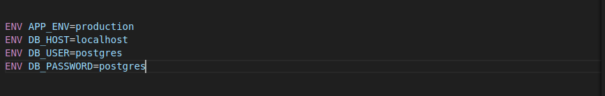

# Hito 3 : Creación de un contenedor para pruebas

## Elección de un contenedor base

Para esta parte del proyecto se eligió un contenedor base para el proyecto en PHP y PgAdmin. 

Se utilizará una imagen PHP, que proporciona un entorno de ejecución PHP estandarizado y reproducible. Esto es crucial para asegurar que tu aplicación se ejecute de la misma manera en diferentes entornos, ya sea en desarrollo, pruebas o producción. También puedes aprovechar la integración con otros servicios de Docker, como bases de datos, servidores web y sistemas de orquestación de contenedores.

La imagen oficial de PostgreSQL nos proporcionará un entorno de base de datos estandarizado y reproducible; la imagen de PostgreSQL generalmente viene preconfigurada con las opciones más comunes y recomendadas para un entorno de base de datos PostgreSQL.

Realizar la instalación de dichas imagenes

Aqui comprobaremos que las imagenes se encuentran dentro del contenedor

## Configuración del contenedor

### Archivo Dockerfile

Creamos el archivo Dockerfile para realizar la configuración de PHP

 - Construiremos nuestro contenedor base a partir de la imagen oficial de PHP 8.2.
 

 - Definimos el usuario root debido a que necesitaremos permisos de administrador para instalar composer.
 

 - Establecemos el directorio dentro del contenedor en /var/www/html.
 

 - Copiamos los archivos de configuración de apacher de la carpeta base en las carpetas del contenedor
 

 - Construiremos contenedor a partir de la imagen postgres
 

 - Definición de variables de entorno:
 

Asi quedaria el archivo [Dockerfile](https://github.com/gabrielacampoverde/CC_Gabriela/blob/main/ERP-Inventario/Dockerfile)

### Archivo docker-compose.yml

Luego pasaremos a la configuración de [docker-compose.yml](https://github.com/gabrielacampoverde/CC_Gabriela/blob/main/ERP-Inventario/docker-compose.yml).

- El servicio php-apache utiliza la imagen oficial de PHP con Apache y expone el puerto 80.

- El servicio pgadmin utiliza la imagen oficial de pgAdmin4, se ha configurado con un usuario y contraseña.

El archivo final para [docker-compose.yml](https://github.com/gabrielacampoverde/CC_Gabriela/blob/main/ERP-Inventario/docker-compose.yml) es el siguiente.

