# Hito 4: Integración continua

## Sistema de Integración Continua
 
La elección del sistema de integración continua se baso en las necesidades específicas del proyecto y del desarrollo. Uno de los sistemas más populares y ampliamente utilizados es Jenkins.

### Jenkins 

- Jenkis facilita la integración continua al conectarse con tu sistema de control de versiones como Git y ejecutar automáticamente las pruebas después de cada confirmación.

- Ya que se trabaja con PHP y JavaScript Jenkins puede integrarse con herramientas como Composer para PHP y npm para JavaScript para gestionar las dependencias del proyecto. Esto garantiza que las bibliotecas y dependencias estén actualizadas y se construyan de manera coherente.

- Jenkins puede automatizar el proceso de construcción del proyecto, lo que implica compilar el código fuente, gestionar dependencias y generar artefactos ejecutables

- Jenkins es una herramienta versátil y potente que puede mejorar la eficiencia del desarrollo y la calidad del código como es el proyecto que involucran tecnologías como PHP, HTML, CSS y JavaScript.

## Instación y Configuración de Jenkins

La instalación y configuración de Jenkins en Docker puede realizarse siguiendo los pasos a continuación:

a. Descargar e iniciar el contenedor de Jenkins:
 	docker run -p 8080:8080 -p 50000:50000 -v jenkins_home:/var/jenkins_home jenkins/jenkins:lts
 

Donde:

- -p 8080:8080 y -p 50000:50000 mapean los puertos 8080 y 50000 del contenedor a los mismos puertos en el host.
- v jenkins_home:/var/jenkins_home monta un volumen para persistir los datos de Jenkins entre reinicios del contenedor.
- jenkins/jenkins:lts especifica la imagen de Jenkins de la versión LTS.

b. Acceder a Jenkins en el navegador

Abrimos el navegador web y revisamos  http://localhost:8080.

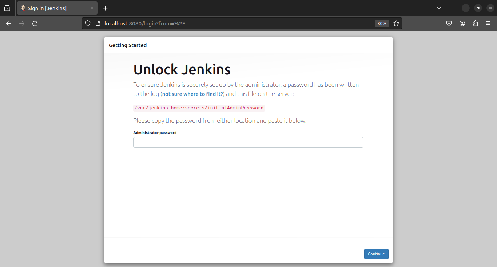

Jenkins te pedirá la contraseña inicial, que puedes obtener ejecutando:

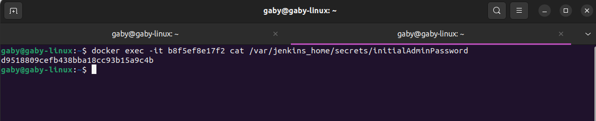

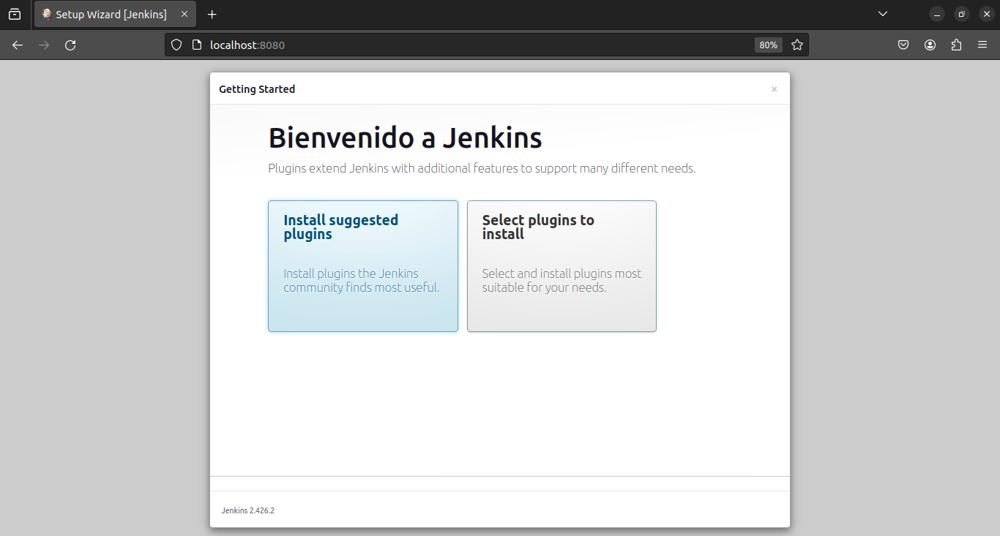

c. Luego se instalaron los complementos sugeridos por Jenkins para las funcionalidades adicional.

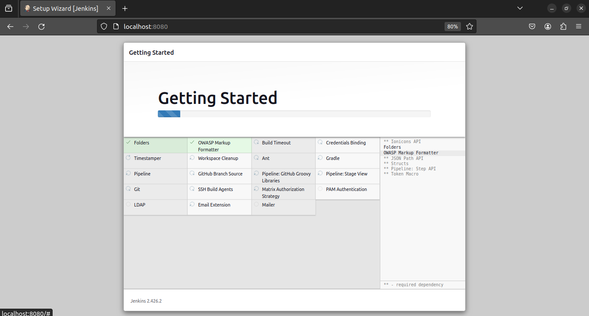

De la mano con la creación de una cuenta.

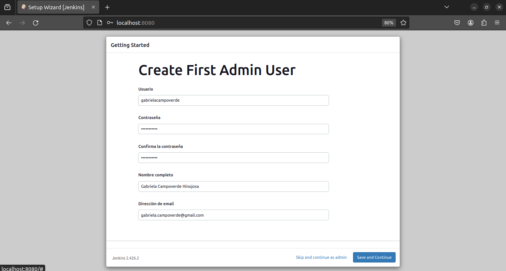

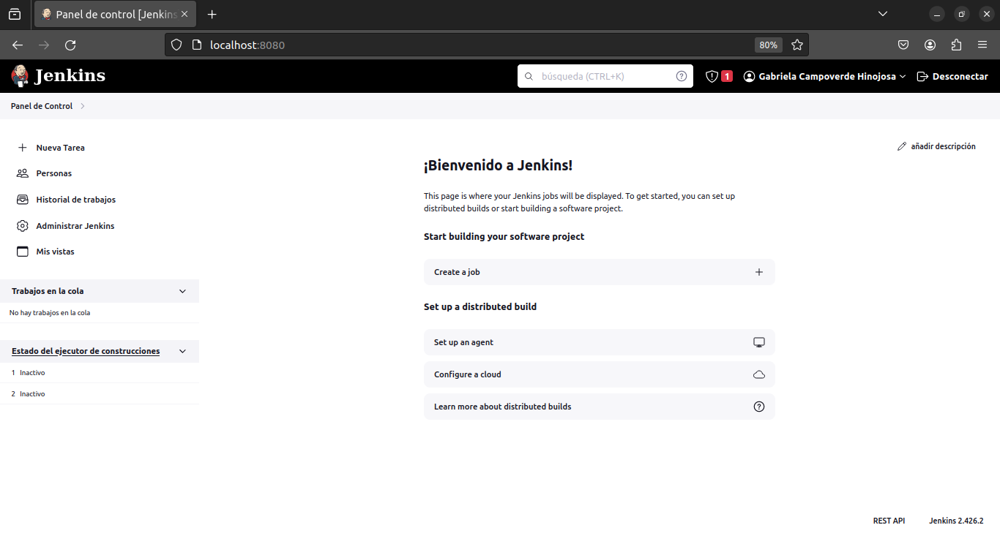

## Creación de fichero docker-compose.yaml

Ingreamos el siguiente comando para abrir un archivo nuevo

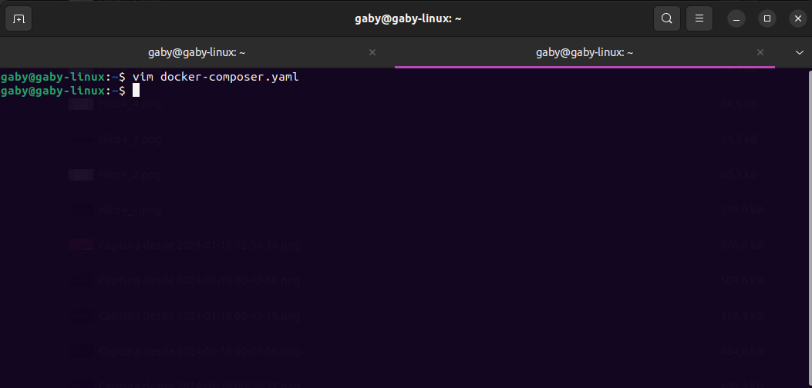

Luego ingresar lo siguiente

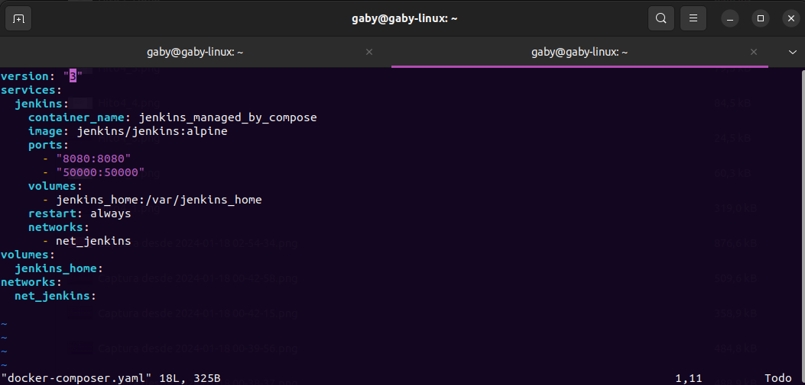

Una vez tienes el fichero docker-compose.yaml creado tendremos que levantar el contenedor de jenkins para volver a configurar nuevamente el contenedor.

## Creación del Proyecto en Jenkins

Con Jenkins ejecutandose creamos un nuevo proyecto, y este es el resultado

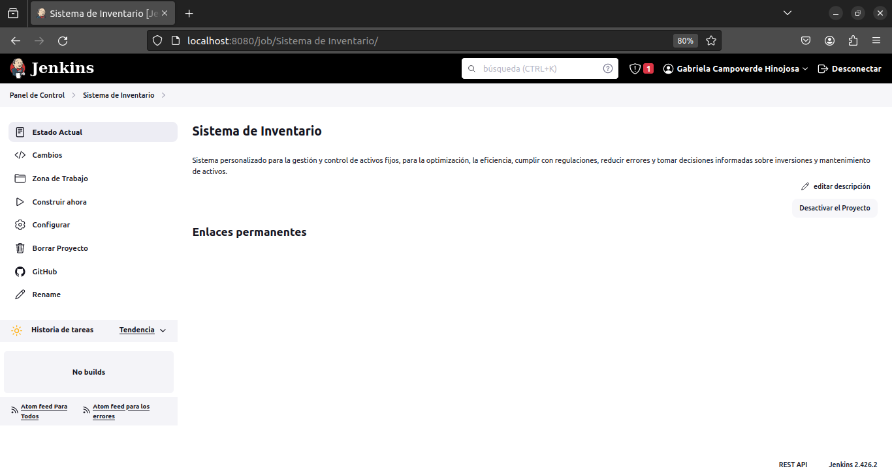

Realizamos la configuración con el proyecto en github

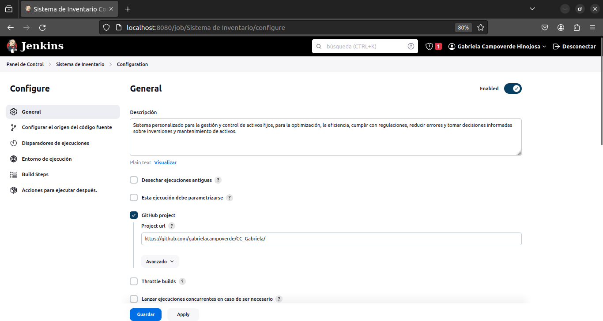

Y con la siguiente imagen vemos que fue exitosa la configuración

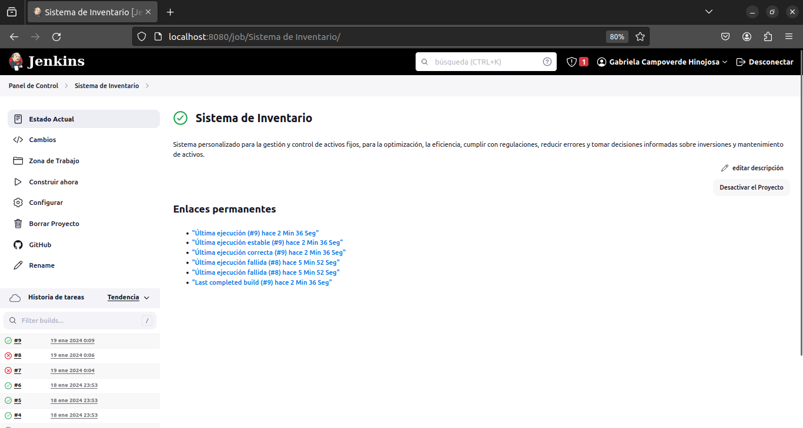

