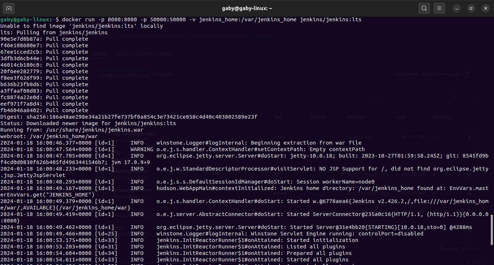

# Hito 4: Integración continua

## Configurar el sistema de integración continua: Jenkins
 
La elección del sistema de integración continua se baso en las necesidades específicas del proyecto y del desarrollo. Uno de los sistemas más populares y ampliamente utilizados es Jenkins, el cual usaremos para nuestro proyecto.

## Instación de Jenkins

La instalación y configuración de Jenkins en Docker puede realizarse siguiendo los pasos a continuación:

a. Descargar e iniciar el contenedor de Jenkins:
 	docker run -p 8080:8080 -p 50000:50000 -v jenkins_home:/var/jenkins_home jenkins/jenkins:lts
 

Donde:

- -p 8080:8080 y -p 50000:50000 mapean los puertos 8080 y 50000 del contenedor a los mismos puertos en el host.
- v jenkins_home:/var/jenkins_home monta un volumen para persistir los datos de Jenkins entre reinicios del contenedor.
- jenkins/jenkins:lts especifica la imagen de Jenkins de la versión LTS.

b. Acceder a Jenkins en el navegador

Abrimos el navegador web y revisamos  http://localhost:8080.

Jenkins te pedirá la contraseña inicial, que puedes obtener ejecutando:

## Instación de Jenkins

