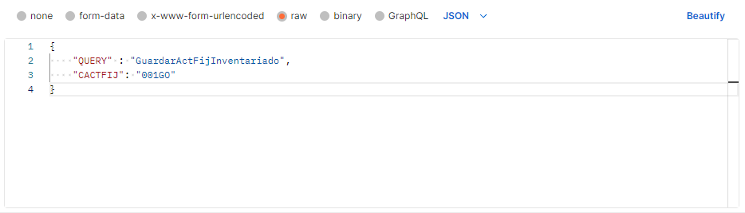

# Hito 5: Diseño y test de un microservicio

## Framework
 
Si has decidido no utilizar frameworks para el desarrollo de APIs en PHP, ya que los requisitos de la API son relativamente simples y directos, sin requerir una complejidad significativa en términos de manejo de rutas, validación de datos y autenticación compleja.

En algunos casos, un código más simple y directo puede resultar en un mejor rendimiento, reduce las dependencias externas en tu proyecto. Desarrollar sin un framework te da la flexibilidad de diseñar la arquitectura y la estructura del código según las necesidades específicas del proyecto.
 
## Diseño en general del API

Para el desarrollo de las APIs se trabajara en PHP, y la arquitectura sera la siguiente:

En la primera parte tendremos el encabezados HTTP en PHP que se utilizan comúnmente para configurar la política de mismo origen (CORS) en un servidor web. Estos encabezados permiten o restringen las solicitudes desde diferentes orígenes a acceder a recursos en tu servidor.

Luego tenemos las clases que necesitamos, como por ejemplo la clase de CSql, la cual es la clase  que se conecta con la base de datos, en este caso trabajamos con postgres. Tambien tenemos la clase CConsultarActFij, en dicha clase se encuentra todas las funciones que traen la información de la base de datos.

En en el siguiente grupo de código tenemos un controlador en PHP para manejar solicitudes POST JSON que contienen un campo llamado "QUERY". Según el valor de "QUERY", el controlador invoca diferentes funciones.

Las funciones que se muestran acontinuación, estás creando una instancia de la clase CConsultarActFij en cada función para realizar consultas específicas. Estas funciones están diseñadas para manejar solicitudes específicas de los APIs y devolver respuestas JSON.

La implementación de la clase CConsultarActFij manejar la consulta de activos fijos en una base de datos PostgreSQL.

## Postman

Si ha decidido utilizar Postman para la prueba de microservicios, ya que Postman es una herramienta muy útil para realizar solicitudes HTTP, probar endpoints y documentar APIs. Postman nos permite crear y ejecutar pruebas automatizadas para tus API.

Postman te permite simular varios tipos de solicitudes HTTP, como GET, POST, PUT, DELETE, etc. Esto es útil para probar diferentes rutas y operaciones en tu API.

- El primer API, es la consulta de un activo fijo por su código, este nos devuelve toda la información del activo fijo, como su descripcion, tipo de activo fijo, personal responsable, centro de costo, centro de responsabilidad al que pertenece, nro de serie, color, marca, fecha que ingreso, entre otro datos.

- Esta API nos ayuda con la consulta de los centros de costo, la busqueda se realiza por el nombre del centro de costo, y no tiene que ser el nombre completo, basta con ingresar al menos 4 letras y este te muestra todas las opciones con esas letras.

- Este API es el que ayudara con el registro del inventario, en el cual solo se necesita el código del activo y este realizara la acción de grabar en la base de datos que el activo fijo esta inventariado.

- Esta API tranfiere un activo fijo de una oficina a otra, aqui solo se necesita el código del activo fijo, la oficina de destino, la nueva persona responsable del activo fijo y la persona quien realizo la acción.

## Logs

Se utiliza un formato JSON para facilitar el análisis automático y la búsqueda, también se registran acciones exitosas para rastrear el comportamiento normal de la aplicación.

Los logs registran errores y excepciones, proporcionando detalles que ayudan a identificar y corregir problemas.

