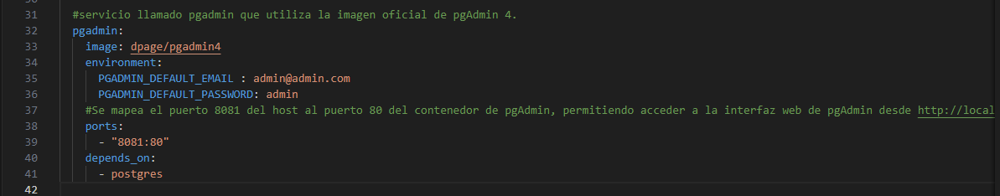

# Hito 6: Composición de Servicios

## Documentación y Justificación de la estructura del clúster.

Como se explico desde un inicio el proyecto se desarrollo en frontend con html y css y en el banckend con PHP, utilizando tambien la base de datos de Postgresql, es por eso que cuando una aplicación consta de varios componentes o servicios, cada uno de ellos puede ser representado como un servicio separado en el archivo docker-compose.yml; esto proporciona una separación lógica y modularidad.

En mi caso un servicio depende de otro, ya quees una aplicación web que depende de una base de datos, se utilizó la opción depends_on para asegurarse de que los servicios se inicien en el orden correcto.

Se definió una red personalizada para los servicios puede mejorar la seguridad y el aislamiento, estos servicios pueden comunicarse entre sí utilizando los nombres de los servicios.

Se utilizó variables de entorno en el archivo docker-compose.yml facilita la personalización y configuración de servicios, especialmente cuando se trata de configuraciones sensibles, como es el caso de Postgresql.

## Documentación y Justificación de la Configuración del contenedores 

- En el archivo docker-compose.yml iniciamos con la versión del Docker Compose.
- Definir un servicio llamado php
- Configuración de la Construcción del Contenedor, especifique que el contenedor se construirá usando un archivo Dockerfile ubicado en el directorio actual (./).
- Defini el nombre del Contenedor, asignando el nombre php-apache al contenedor.
- Mapeo el puerto 8080 del host al puerto 80 del contenedor, con esto puedo acceder a la aplicación PHP en el navegador a través de http://localhost:8080.

- Definición del Servicio PostgreSQL.
- Se crea la imagen de Postgres, se utiliza la imagen oficial de PostgreSQL desde Docker Hub
- Mapea el puerto 5432 del host al puerto 5432 del contenedor, permitiendo que se acceda a PostgreSQL desde el host
- Se configura variables de entorno para la configuración de PostgreSQL, como el nombre de usuario (POSTGRES_user), la contraseña (POSTGRES_PASSWORD), la base de datos (POSTGRES_DB), y el host (DATABASE_HOST).

- Definó un servicio llamado pgadmin que utiliza la imagen oficial de pgAdmin 4.
- Configuro las variables de entorno para pgAdmin, estableciendo el correo electrónico y la contraseña predeterminados para el usuario administrador.
- Se mapea el puerto 8081 del host al puerto 80 del contenedor de pgAdmin, permitiendo acceder a la interfaz web de pgAdmin desde http://localhost:8081.
- Se indica que este servicio depende del servicio postgres, asegurando que el contenedor de PostgreSQL esté en ejecución antes de iniciar pgAdmin.

## Fichero de Composición

Utilizamos el comando docker-compose up -d, el cual se utiliza para iniciar los servicios definidos en un archivo docker-compose.yml en modo detached.

## Testeo del Cúster.

Para probar la base de datos abrimos un navegador y colocamos http://localhost:8081, y lo primero que nos pide es login para ingresar en la interfaz web de Postgres.

Luego creamos una nueva conexión, con los parametros que definimos en el archivo docker-compose.yml

Y luego nos damos cuenta que la base de datos fue creada con exito.

